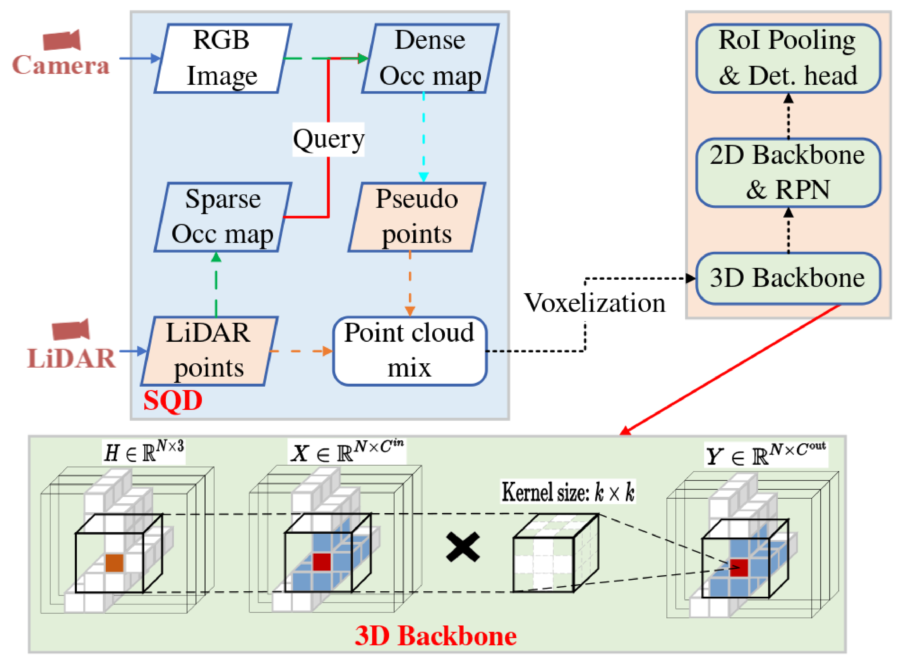

# Sparse Query Dense (SQD): Enhancing 3D Object Detection with Pseudo Points

<p align="left">
  
</p>

## ❗ Motivation

LiDAR sensors are widely used in 3D object detection due to their precise distance measurements and robustness to lighting conditions. However, LiDAR often captures only a sparse set of points on distant object surfaces, while RGB cameras can capture hundreds of pixels for the same region.

To compensate for this sparsity, a common practice is to project image pixels into 3D space as **pseudo points**, enriching the LiDAR point cloud. Nevertheless, this introduces two key challenges:

1. **High computational cost**: The large number of pseudo points leads to slow and inefficient preprocessing.

2. **Noisy depth estimation**: Pseudo points generated from depth completion networks often lack accurate local geometry—especially at object boundaries—introducing noise that can degrade detection performance.

**SQD** is designed to address these issues by selecting informative pseudo points in a sparse-yet-effective manner.


---

## 🔧 Requirements

Tested under the following environment:
- Ubuntu 18.04
- Python 3.9
- PyTorch 1.10.1
- CUDA 11.1
- [`spconv v2.x`](https://github.com/traveller59/spconv)

---

## ⚙️ Environment Setup

### 1. Set CUDA environment variables

```bash
export CUDA_HOME=/usr/local/cuda-11.1/
export LD_LIBRARY_PATH=/usr/local/cuda-11.1/lib64/
```

### 2. Create conda environment

```bash
conda env create -f env.yaml
conda activate sqd
```

If this fails, try manual installation:

```bash
conda install cudatoolkit=11.1 -c pytorch-lts -c nvidia
pip install torch==1.10.1+cu111 torchvision==0.11.2+cu111 torchaudio==0.10.1 -f https://download.pytorch.org/whl/cu111/torch_stable.html
```

---

## 🔩 Install Dependencies

### 1. Install spconv

```bash
pip install spconv-cu111
```

Or follow [spconv manual installation](https://github.com/traveller59/spconv).

### 2. Install OpenPCDet & CUDA ops

```bash
cd SQD/
python setup.py develop

cd pcdet/ops/iou3d/cuda_op/
python setup.py develop
cd ../../../..
```

---

## 📁 Dataset Preparation (KITTI)

1. Download KITTI dataset and organize it following [OpenPCDet instructions](https://github.com/open-mmlab/OpenPCDet).
2. Generate sparse depth maps:
    - Project LiDAR points from 3D to 2D images
```bash
cd SQD/
python lidar_to_depth_to.py
```
3. Generate dense depth maps:
   - Option 1: Use [KBNet](https://github.com/alexklwong/calibrated-backprojection-network)
   - Option 2: Use [SFD-TWISE](https://github.com/LittlePey/SFD-TWISE) (recommended)
4. Convert depth maps to pseudo point clouds:

```bash
cd SQD/
python depth_to_lidar.py
```

5. (Optional) Use preprocessed files:  
   - [Google Drive](https://drive.google.com/drive/folders/1nrgj1pAYGfNSb3MPLrkuLW27WWyJc68a?usp=sharing)  
   - [Baidu Netdisk (code: swre)](https://pan.baidu.com/s/1uq-xD6e5mGUdYm7ROvV6Jw?pwd=swre)

6. Directory structure:

```
SQD/
├── data/
│   └── kitti_sfd_seguv_twise/
│       ├── ImageSets/
│       ├── training/
│       │   ├── calib, velodyne, label_2, image_2, planes (optional)
│       │   ├── depth_dense_kbnet/
│       │   └── depth_pseudo_rgbseguv_dense_kbnet/
│       ├── testing/
│       │   ├── calib, velodyne, image_2, depth_dense_kbnet, ...
│       ├── gt_database/
│       ├── gt_database_pseudo_seguv/
│       ├── kitti_infos_*.pkl
```

7. Create KITTI infos:

```bash
cd pcdet/datasets/kitti/
python kitti_dataset_sfd.py create_kitti_infos
```

---

## 🚀 Getting Started

### ⚠️ Before Training:
- Modify `DATA_PATH` in `cfgs/kitti_models/sqd.yaml` to your dataset path.
- Modify `_BASE_CONFIG_` in the config if necessary.

### 1. Training

```bash
cd SQD/tools/

python -m torch.distributed.launch --nproc_per_node=3 train.py \
    --launcher pytorch \
    --cfg_file cfgs/kitti_models/sqd.yaml \
    --gpu_id 1,2,3 \
    --batch_size 24 \
    --epochs 100 \
    --extra_tag test \
    --workers 3
```

### 2. Evaluation

```bash
# Single checkpoint
python -m torch.distributed.launch --nproc_per_node=2 test.py \
    --launcher pytorch \
    --cfg_file cfgs/kitti_models/sqd.yaml \
    --ckpt /path/to/checkpoint_epoch_40.pth \
    --gpu_id 1,2 \
    --batch_size 40 \
    --extra_tag test_eval_all \
    --save_to_file \
    --workers 2

# Evaluate all checkpoints
python -m torch.distributed.launch --nproc_per_node=2 test.py \
    --launcher pytorch \
    --cfg_file cfgs/kitti_models/sqd.yaml \
    --ckpt_dir /path/to/ckpt/ \
    --gpu_id 1,2 \
    --batch_size 40 \
    --eval_all \
    --extra_tag test_eval_all \
    --workers 2
```

---

## 📌 Code Highlights

### 🔍 Pseudo Point Processing

- **File**: `pcdet/datasets/kitti/kitti_dataset_sfd.py`  
- **Function**: `process_data_sqd_sample`  
- Pseudo points are downsampled using a separate GPU.

### 🧱 3D Backbone

- **File**: `pcdet/models/backbones_3d/spconv_backbone.py`  
- **Function**: `VoxelBackBone8x`

---

## 🙏 Acknowledgements

We thank the following repositories:

- [OpenPCDet](https://github.com/open-mmlab/OpenPCDet)
- [PENet](https://github.com/JUGGHM/PENet_ICRA2021)
- [SFD](https://github.com/LittlePey/SFD)
- [VirConv](https://github.com/hailanyi/VirConv)
- [KBNet](https://github.com/alexklwong/calibrated-backprojection-network)
- [spconv](https://github.com/traveller59/spconv)

---

Feel free to open issues or pull requests. Happy detecting!

---


## 📄 Citation

If you find this project useful, please consider citing our paper:

```bibtex
@inproceedings{10.1145/3664647.3681420,
  author    = {Mo, Yujian and Wu, Yan and Zhao, Junqiao and Hou, Zhenjie and Huang, Weiquan and Hu, Yinghao and Wang, Jijun and Yan, Jun},
  title     = {Sparse Query Dense: Enhancing 3D Object Detection with Pseudo Points},
  booktitle = {Proceedings of the 32nd ACM International Conference on Multimedia},
  year      = {2024},
  pages     = {409--418},
  publisher = {Association for Computing Machinery},
  address   = {New York, NY, USA},
  doi       = {10.1145/3664647.3681420},
  url       = {https://doi.org/10.1145/3664647.3681420}
}
```

---

## ❓ Future Directions

Future work can explore the following aspects to further improve SQD:

1. **Reduce hyperparameter dependency**: Make the pseudo point querying and selection process more adaptive and efficient.
2. **Category generalization**: Extend SQD from vehicle class to other categories to improve performance in diverse scenes.
3. **Improve occlusion handling**: Develop better strategies for pseudo point completion in occluded regions.
4. **Robustness validation**: Test SQD on more challenging datasets to evaluate its generalizability and robustness.
